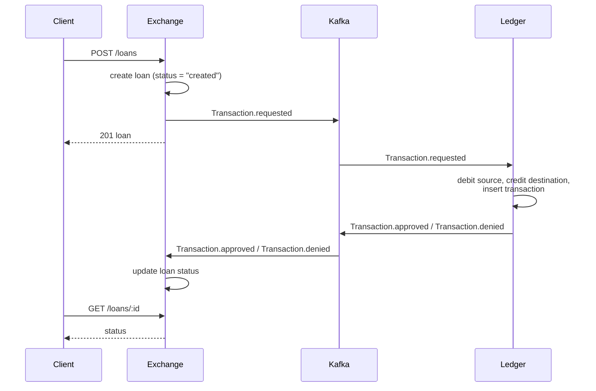

# Bank — a Clojure microservices demo

A small Bank application written in **Clojure**, structured around **hexagonal architecture** and split into two **microservices** that communicate through **Kafka** events. Each service owns its own **PostgreSQL** database, a **ClojureScript** single-page app provides the UI, and a **Nginx** reverse proxy fronts both the UI and the public API on one origin.

Built with: Clojure 1.12, Finagle (HTTP), next.jdbc + HoneySQL, PostgreSQL 15, Apache Kafka (KRaft, single-node), ClojureScript (shadow-cljs · Reagent · re-frame), Nginx, Docker Compose.

## Architecture

Two bounded contexts, each a microservice with its own database:

- **Ledger** — owns money: `accounts` and `transactions`.
- **Exchange** — owns financial products: `investors`, `issuers`, and `loans`.

Both services follow the same hexagonal layout under `src/bank/`:

```
domain/        # Records and pure business rules (no I/O)
application/   # Use cases that orchestrate the domain via ports
ports/         # Protocols (Repository, EventPublisher) — the interfaces
adapters/      # Concrete implementations: Finagle HTTP, Postgres, Kafka
```

### Service ports

| Component       | Container            | Host port |
|-----------------|----------------------|-----------|
| Reverse proxy   | `reverse-proxy`      | `8080`    |
| Frontend SPA    | `frontend-app`       | _(via proxy)_ |
| Ledger HTTP     | `ledger-service-app` | `3001`    |
| Exchange HTTP   | `exchange-service-app` | `3002`  |
| Ledger DB       | `ledger-service-db`  | `5001`    |
| Exchange DB     | `exchange-service-db`| `5002`    |
| Kafka broker    | `kafka`              | `9092`    |

The proxy serves the frontend at `/`, and routes `/api/ledger/*` to the ledger service and `/api/exchange/*` to the exchange service — see [reverse_proxy/nginx.conf](microservices/reverse_proxy/nginx.conf). The SPA has no host port of its own; it is reached only through the proxy, which keeps it same-origin with the API (so no CORS handling is needed).

### Kafka topics

| Topic                   | Producer | Consumer | Purpose                                                  |
|-------------------------|----------|----------|----------------------------------------------------------|
| `Transaction.requested` | exchange | ledger   | Exchange asks the ledger to settle a loan as a transfer. |
| `Transaction.approved`  | ledger   | exchange | Ledger confirms the transfer happened.                   |
| `Transaction.denied`    | ledger   | exchange | Ledger rejects the transfer (e.g. insufficient funds).   |

### Loan settlement flow



The diagram shows the logical flow; the section below explains how each hop is made durable.

## Reliability & consistency

The two services coordinate over Kafka, which delivers **at least once**. To keep money from being lost, double-counted, or left half-applied, three mechanisms work together.

### Transactional operations

Every money movement runs as a single database transaction through a `with-tx` unit-of-work port: the application layer expresses *"do this atomically"*, and the Postgres adapter binds one transacted connection for the whole unit.

- **Ledger** — a deposit, withdrawal, or transfer updates balances **and** inserts the transaction row all-or-nothing. A transfer locks both account rows (`SELECT … FOR UPDATE`, in a sorted order to avoid deadlocks) and enforces `balance >= 0` in the domain, so concurrent transfers can't lose updates or overdraw.
- **Exchange** — creating a loan inserts the loan **and** enqueues its settlement event in one transaction (see the outbox below).

If any step fails, the whole unit rolls back and nothing is written.

### Idempotent consumers

Because Kafka can redeliver, a consumer may see the same event twice. Handlers are idempotent, so reprocessing is a no-op:

- **Ledger** keeps a `processed_events` **inbox**. Settlement records the event's outcome (`approved` / `denied`) in the *same transaction* as the money movement; a redelivered event replays the recorded outcome instead of moving money again (and a denial stays a denial).
- **Exchange** uses the loan's own status as the dedupe record — a settlement for a loan that is no longer `created` is skipped.

### Transactional outbox

Publishing to Kafka right after a DB commit is a dual-write: a crash in between would lose the event. Instead, a producer writes the event into an `outbox` table **in the same transaction** as the business change. A background **relay** polls unsent rows and publishes them to Kafka, marking a row sent only after the broker acknowledges — so a crash simply re-sends it.

State change and event publication are therefore atomic. Combined with idempotent consumers, the round-trip achieves an end-to-end **exactly-once effect** over at-least-once transport.

| Concern                  | Ledger                             | Exchange                |
|--------------------------|------------------------------------|-------------------------|
| Unit-of-work transaction | balances + transaction row         | loan + outbox row       |
| Idempotency record       | `processed_events` inbox           | loan `status`           |
| Outbox events            | `Transaction.approved` / `.denied` | `Transaction.requested` |

## Requirements

- Docker (with Compose v2).
- A `microservices/.env` file with these variables:

```dotenv
LEDGER_SERVICE_POSTGRES_DB=ledger
LEDGER_SERVICE_POSTGRES_USER=ledger
LEDGER_SERVICE_POSTGRES_PASSWORD=changeme

EXCHANGE_SERVICE_POSTGRES_DB=exchange
EXCHANGE_SERVICE_POSTGRES_USER=exchange
EXCHANGE_SERVICE_POSTGRES_PASSWORD=changeme
```

## Build & run

From the `microservices/` directory, with Docker running:

```bash
# day to day — cached build, keeps data:
docker compose build && docker compose up -d

# clean slate — wipes volumes so init.sql re-runs (needed after a schema change):
docker compose down -v --remove-orphans && docker compose build && docker compose up -d
```

Convenience runners wrap these. On Windows, `stack.cmd`:

```cmd
stack up      :: build (cached) and start in the background
stack reset   :: wipe data, rebuild, start
stack logs    :: tail logs (e.g. "stack logs ledger-service-app" for one service)
stack down    :: stop, keeping data
```

Or cross-platform with GNU Make (from `microservices/`): `make up`, `make reset`, `make logs` (`make logs SVC=<service>`), `make down`.

Once everything is up, the **web UI** is at `http://localhost:8080/`, the public API is under `http://localhost:8080/api/`, and a few dashboards come up alongside them:

| Tool     | URL                     | For                                  |
|----------|-------------------------|--------------------------------------|
| Dozzle   | `http://localhost:8081` | container logs                       |
| Kafka UI | `http://localhost:8082` | topics, messages, consumer-group lag |
| Adminer  | `http://localhost:8083` | both Postgres databases              |

## API

All endpoints accept and return `application/json`. Money values are encoded as **BigDecimal-tagged strings** with a trailing `M` (e.g. `"1000.00M"`) — both on the way in and on the way out of monetary fields. UUIDs are standard string form.

### Ledger

| Method | Path                     | Body                                                                                    | Notes                                                                 |
|--------|--------------------------|-----------------------------------------------------------------------------------------|-----------------------------------------------------------------------|
| POST   | `/api/ledger/accounts`   | _(none)_                                                                                | Creates an account with a 5-digit number and balance `0.00`.          |
| GET    | `/api/ledger/accounts`   | _(none)_                                                                                | Returns all accounts (JSON array).                                    |
| GET    | `/api/ledger/accounts/:id` | _(none)_                                                                              | Returns the account.                                                  |
| POST   | `/api/ledger/transactions` | See below                                                                             | `type` ∈ {`deposit`, `withdrawal`, `transfer`}; balance updated atomically. |
| GET    | `/api/ledger/transactions` | _(none)_                                                                             | Returns all transactions (JSON array).                               |
| GET    | `/api/ledger/transactions/:id` | _(none)_                                                                          | Returns the transaction.                                              |

Transaction body shape:

```jsonc
// deposit
{ "type": "deposit",    "value": "100.00M", "destination-account-id": "<uuid>" }
// withdrawal
{ "type": "withdrawal", "value": "100.00M", "source-account-id": "<uuid>" }
// transfer
{ "type": "transfer",   "value": "100.00M", "source-account-id": "<uuid>", "destination-account-id": "<uuid>" }
```

### Exchange

| Method | Path                       | Body                                  | Notes                                                              |
|--------|----------------------------|---------------------------------------|--------------------------------------------------------------------|
| POST   | `/api/exchange/investors`  | `{ "account-id": "<uuid>" }`          | Links an investor to a ledger account.                             |
| GET    | `/api/exchange/investors`  | _(none)_                              | Returns all investors (JSON array).                                |
| GET    | `/api/exchange/investors/:id` | _(none)_                           |                                                                    |
| POST   | `/api/exchange/issuers`    | `{ "account-id": "<uuid>" }`          | Links an issuer to a ledger account.                               |
| GET    | `/api/exchange/issuers`    | _(none)_                              | Returns all issuers (JSON array).                                  |
| GET    | `/api/exchange/issuers/:id` | _(none)_                             |                                                                    |
| POST   | `/api/exchange/loans`      | See below                             | Returns immediately with `status: "created"`; settlement is async. |
| GET    | `/api/exchange/loans`      | _(none)_                              | Returns all loans (JSON array).                                    |
| GET    | `/api/exchange/loans/:id`  | _(none)_                              | Status transitions to `approved` or `denied` after Kafka round-trip. |

Loan body:

```json
{
  "principal": "100.00M",
  "rate": "10.00M",
  "inception-date": "2025-01-01",
  "term": 6,
  "investor-id": "<uuid>",
  "issuer-id": "<uuid>"
}
```

## Frontend (ClojureScript)

A single-page app under [`microservices/frontend_service`](microservices/frontend_service) to create,
list, and manage every entity. It keeps the whole stack in one language: **shadow-cljs** build,
**Reagent** views, **re-frame** state, **reitit** routing, talking to the same `/api/*` endpoints the
services expose.

- Served by the reverse proxy at `http://localhost:8080/` — same origin as the API, so no CORS.
- One page per entity (Accounts, Transactions, Investors, Issuers, Loans), each with a create form and
  a live table backed by the list endpoints above.
- The **Loans** page shows the async settlement: a new loan starts `created` and the UI polls
  `GET /loans/:id` until it flips to `approved` or `denied` — making the Kafka/outbox round-trip
  visible in the browser.
- Money is handled as the canonical `"…M"` string end-to-end (ClojureScript has no `BigDecimal`); the
  `bank-ui.util.money` helpers only add/strip the suffix at the wire boundary.

It ships as its own container (multi-stage build: shadow-cljs release → static files on Nginx) and is
picked up by `make up` / `stack up` with the rest of the stack. For local frontend iteration without
Docker: from `microservices/frontend_service`, `npm install` then `npm run dev` (shadow-cljs watch on
`http://localhost:8280`) — note the API still needs the stack running for requests to resolve.

## Bootstrap script

[`microservices/scripts/requests_bootstrap.py`](microservices/scripts/requests_bootstrap.py) drives a full end-to-end happy path against a running stack:

1. Create investor and issuer accounts on **ledger**.
2. Deposit funds into the investor's account.
3. Register the investor and issuer on **exchange**.
4. Create a loan; **exchange** publishes `Transaction.requested`.
5. **Ledger** consumes the request, performs the transfer, and replies with `Transaction.approved` or `Transaction.denied`.
6. **Exchange** consumes the reply and updates the loan status.
7. The script polls the loan until it settles, then prints the final account balances.

Run it with `python microservices/scripts/requests_bootstrap.py` once the stack is up.

## Tests

Each service has its own test suite under `test/bank/` covering the domain, application, and HTTP-controller layers. Run them per-service with the Clojure CLI:

```bash
cd microservices/ledger_service   && clojure -M:test
cd microservices/exchange_service && clojure -M:test
```

Both suites also run on every push and pull request via [`.github/workflows/test.yml`](.github/workflows/test.yml).

## Code style & formatting

The codebase uses a deliberate house style — **4-space block indentation** and **exploded closing
parens** (a multi-line list closes with `)` on its own line, at the list's column). Off-the-shelf Clojure
formatters can't reproduce it, so the repo ships a small bespoke one under
[`microservices/tools/fmt`](microservices/tools/fmt) (built on rewrite-clj). It re-indents and normalizes
spacing but never re-wraps lines, and refuses to write a file unless the reformatted source parses to the
exact same code (a reparse-equality safety guard).

From `microservices/`:

```bash
make fmt         # format every .clj/.cljs/.cljc under the services + frontend
make fmt-check   # verify only; non-zero exit if anything is unformatted
```

CI runs `make fmt-check` (the **Format Check** job in [`test.yml`](.github/workflows/test.yml)) on every
push and pull request. The formatter has its own tests: `cd microservices/tools/fmt && clojure -M:test`.
(Both commands need the Clojure CLI; a JVM-less environment can run the same thing in a container, e.g.
`docker run --rm -v "$PWD":/w -w /w/tools/fmt clojure:openjdk-17 clojure -M:run check ../../ledger_service ../../exchange_service ../../frontend_service`.)

## Next steps

- Tighten the domain layer toward DDD (aggregates, value objects, invariants on update).
- Add integration tests that exercise the full Kafka round-trip with Testcontainers.
- Document error responses and add input validation at the controller boundary.
